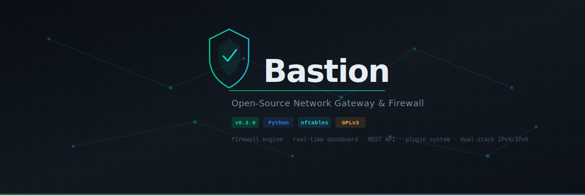
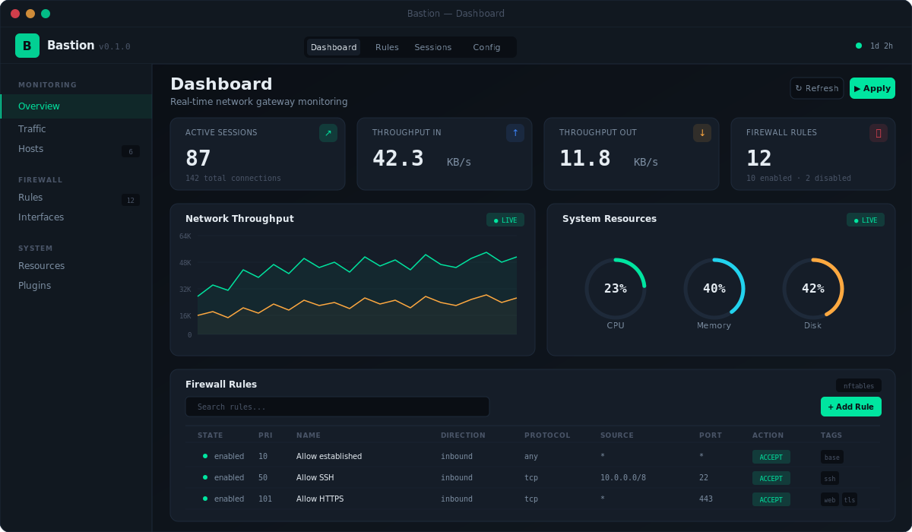

<p align="center">
  
</p>

<p align="center">
  <a href="LICENSE"></a>
  <a href="https://www.python.org/"></a>
  <a href="https://github.com/psf/black"></a>
  <a href="https://github.com/gbudja/bastion/actions"></a>
</p>

<p align="center">
  A modern, open-source network gateway and firewall management platform.<br>
  Built on <strong>nftables</strong>. Managed through a <strong>real-time dashboard</strong> and <strong>REST API</strong>.<br>
  Designed to be the open-source successor to legacy network gateway appliances.
</p>

---

<p align="center">
  
</p>

---

## Why Bastion?

Legacy network gateway appliances are closed-source, bloated, and expensive. Bastion is a clean-room implementation that gives you enterprise-grade firewall management with a modern developer experience:

- **Declarative rules** — Define your firewall in YAML. Version control your security policy alongside your infrastructure.
- **Atomic application** — Rules are validated and applied in a single nftables transaction. No partial states. Built-in rollback.
- **Real-time visibility** — Live dashboard with throughput charts, system gauges, connection tracking, and host discovery.
- **API-first** — Every action available in the UI is available through the REST API. Automate everything.
- **Extensible** — Plugin architecture with event bus for adding DNS filtering, IDS/IPS, VPN management, and more.

## Quick Start

```bash
git clone https://github.com/gbudja/bastion.git
cd bastion
python3 -m venv venv && source venv/bin/activate
pip install -e ".[dev]"
```

**Run in demo mode** (no root required — simulated data):
```bash
bastion start --demo
```

**Run in production** (requires root + nftables):
```bash
sudo bastion start --config config/bastion.yaml
```

Dashboard at `http://localhost:8443` · API at `http://localhost:8443/api/v1`

## Architecture

```
┌─────────────────────────────────────────────┐
│               Web Dashboard                 │
│            (Flask + WebSocket)              │
├─────────────────────────────────────────────┤
│                REST API                     │
│             /api/v1/rules                   │
│             /api/v1/monitor                 │
│             /api/v1/plugins                 │
├──────────┬──────────┬──────────┬────────────┤
│ Firewall │ Network  │ Plugin   │  Alert     │
│  Engine  │ Monitor  │ System   │  Engine    │
├──────────┴──────────┴──────────┴────────────┤
│              Core Framework                 │
│       Config · Logging · Event Bus          │
├─────────────────────────────────────────────┤
│          Linux nftables / netfilter         │
└─────────────────────────────────────────────┘
```

## Firewall Engine

Bastion translates declarative YAML rules into nftables commands and applies them atomically.

**Define rules in YAML:**
```yaml
- name: Allow SSH
  direction: inbound
  protocol: tcp
  source_address: "10.0.0.0/8"
  destination_port: "22"
  action: accept
  priority: 50
  tags: [management, ssh]
```

**Or manage via API:**
```bash
# Create a rule
curl -X POST http://localhost:8443/api/v1/rules \
  -H "Content-Type: application/json" \
  -d '{"name": "Allow HTTPS", "protocol": "tcp", "destination_port": "443", "action": "accept"}'

# Validate without applying
curl http://localhost:8443/api/v1/rules/validate

# Apply atomically
curl -X POST http://localhost:8443/api/v1/rules/apply
```

**Key capabilities:**
- IPv4/IPv6 dual-stack support
- Rule conflict detection and validation
- Rate limiting and connection tracking
- Rule grouping, tagging, and search
- Dry-run mode and rollback
- YAML persistence with atomic nft script generation

## API Reference

| Method | Endpoint | Description |
|--------|----------|-------------|
| `GET` | `/api/v1/rules` | List rules (supports `?q=`, `?group=`, `?state=` filters) |
| `POST` | `/api/v1/rules` | Create rule |
| `PUT` | `/api/v1/rules/:id` | Update rule |
| `DELETE` | `/api/v1/rules/:id` | Delete rule |
| `POST` | `/api/v1/rules/:id/toggle` | Enable/disable rule |
| `POST` | `/api/v1/rules/apply` | Apply ruleset atomically |
| `GET` | `/api/v1/rules/validate` | Dry-run validation |
| `POST` | `/api/v1/rules/rollback` | Revert to previous state |
| `GET` | `/api/v1/monitor/stats` | System + network metrics |
| `GET` | `/api/v1/monitor/hosts` | Discovered hosts |
| `GET` | `/api/v1/monitor/sessions` | Active connections |
| `GET` | `/api/v1/plugins` | Plugin status |

## Configuration

```bash
cp config/bastion.example.yaml config/bastion.yaml
```

```yaml
server:
  host: 0.0.0.0
  port: 8443

firewall:
  backend: nftables
  default_policy: drop
  enable_ipv6: true
  rules_file: /etc/bastion/rules.yaml

monitoring:
  interval: 5
  retention: 86400

plugins:
  enabled: []
```

## Development

```bash
# Run tests
pytest tests/ -v --cov=bastion

# Lint + format
black bastion/ tests/
ruff check bastion/ tests/

# Type checking
mypy bastion/
```

## Project Structure

```
bastion/
├── bastion/
│   ├── core/
│   │   ├── models.py      # Rule, Chain, Table, RuleSet definitions
│   │   ├── engine.py       # nftables backend — translation + execution
│   │   ├── manager.py      # CRUD, search, persistence, validation
│   │   └── monitor.py      # System metrics, network stats, host discovery
│   ├── api/
│   │   └── routes.py       # REST API endpoints
│   ├── web/
│   │   ├── app.py          # Flask application factory
│   │   └── templates/      # Dashboard HTML
│   ├── plugins/
│   │   └── __init__.py     # Plugin base class, event bus, loader
│   └── cli.py              # CLI entry point (Click)
├── config/
│   ├── bastion.example.yaml
│   └── rules.example.yaml
├── tests/
│   └── test_firewall.py    # 18 tests covering models, engine, manager
├── .github/workflows/ci.yml
├── pyproject.toml
└── CONTRIBUTING.md
```

## Roadmap

- [x] Firewall rules engine (nftables)
- [x] REST API with full CRUD
- [x] Real-time dashboard
- [x] Plugin system with event bus
- [x] CLI with demo mode
- [x] CI/CD pipeline
- [ ] DNS filtering plugin
- [ ] IDS/IPS integration (Suricata)
- [ ] WireGuard VPN management
- [ ] Bandwidth shaping (tc)
- [ ] LDAP/RADIUS authentication
- [ ] HA clustering
- [ ] Terraform provider

## Contributing

See [CONTRIBUTING.md](CONTRIBUTING.md) for development setup and guidelines.

## License

[GPL-3.0](LICENSE) — Free and open-source, forever.
